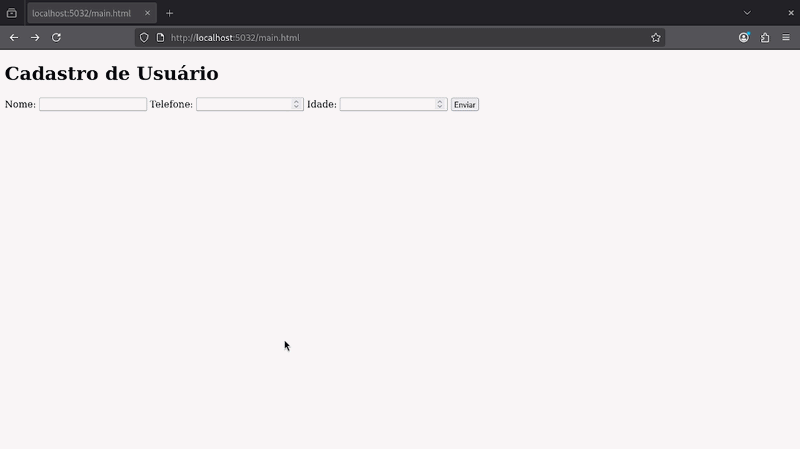

#   Cadastro Formulário ASP.NET Core

## Sobre este projeto

Este projeto é um **formulário HTML simples** que envia dados para uma tabela usando **ASP.NET Core**.  
O objetivo é **aprender C# para web**, estudando **middleware, rotas e manipulação de dados em memória**.

- HTML, CSS e JS estão na pasta `wwwroot`.  
- Os dados enviados pelo formulário são processados pelo backend C# usando `MapPost`.  
- Serve como exemplo de **rotas POST, Request.Form e Response**.

---

## Demonstração



---

## Explicação do Código

O código principal no arquivo `Program.cs` funciona da seguinte forma:

```csharp
using Microsoft.AspNetCore.Builder;
using Microsoft.AspNetCore.Http;
using Microsoft.Extensions.Hosting;

var builder = WebApplication.CreateBuilder(args); // Cria o builder com configuração e ambiente
var app = builder.Build(); // Monta o aplicativo real que vai receber requisições

app.UseStaticFiles(); // Permite que arquivos da pasta wwwroot sejam servidos

// Cria uma rota POST para receber dados do formulário
app.MapPost("/cadastro", (HttpRequest request) =>
{
    string nome = request.Form["nome_usuario"];
    int telefone = int.Parse(request.Form["telefone_usuario"]);
    int idade = int.Parse(request.Form["idade_usuario"]);

    return $"Nome: {nome}, Idade: {idade}, Telefone: {telefone}";
});

app.Run(); // Inicia o servidor e começa a ouvir requisições HTTP